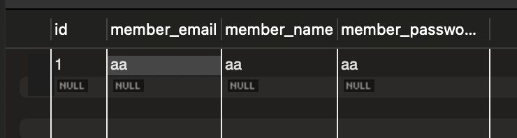
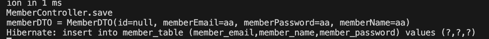

# Spring boot 회원가입
##### build.gradle
```
	// JPA
	implementation 'org.springframework.boot:spring-boot-starter-data-jpa'
	// Mysql 
	runtimeOnly "com.mysql:mysql-connector-j"
```
- JPA와 Mysql 추가

##### application.yml
```
# database
spring:
  datasource:
    driver-class-name: com.mysql.cj.jdbc.Driver
    # 만들어둔 DB이름
    url: jdbc:mysql://localhost:3306/spring_test?serverTimezone=Asia/Seoul&characterEncoding=UTF-8
    username: springtest
    password: 1234
# jpa
  jpa:
    database-platform: org.hibernate.dialect.MySQLDialect
    open-in-view: false
    show-sql: true
    hibernate:
        ddl-auto: create
```
- Database설정과 jpa설정 추가

##### save.html
```
<!DOCTYPE html>
<html lang="en">
<head>
    <meta charset="UTF-8">
    <meta name="viewport" content="width=device-width, initial-scale=1.0">
    <title>save</title>
</head>
<body>
<form action="/member/save" method="post">
    Email : <input type="text" name="memberEmail"><br>
    Password : <input type="password" name="memberPassword"><br>
    Name : <input type="text" name="memberName"><br>
    <input type="submit" value="회원가입">
</form>
</body>
</html>
```
- Email, Name, Password를 입력하는 간단한 회원가입 폼

##### MemberController.java
```
@Controller
@RequiredArgsConstructor
public class MemberController {

    private final MemberService memberService;

    @GetMapping("/member/save")
    public String saveForm() {return "save";}

    @PostMapping("/member/save")
    public String save(@ModelAttribute MemberDTO memberDTO) {
        System.out.println("MemberController.save");

        System.out.println("memberDTO = " + memberDTO);
        // 값 저장
        memberService.save(memberDTO);
        return "login";
    }   
}
```
- @RequiredArgsConstructor로 memberService를 매개변수로 하는 컨트롤러 생성자를 만들어준다
    - MemberController 빈으로 등록시 memberService에 대한 객체를 사용할 수 있다
- @GetMapping("/member/save")로 회원가입 페이지를 보여준다
    - /member/save로 get방식으로 요청시
- @PostMapping("/member/save")로 회원가입을 한다
    - /member/save로 post방식으로 요청시
    - save.html에서 form은 post방식이다
- @ModelAttribute MemberDTO memberDTO는 MemberDTO.java의 필드값들과 name의 값이 같다면 자동으로 생성해준다
- memberService.save(memberDTO)로 memberService에 save메서드를 호출한다

##### MemberDTO.java
```
@Getter
@Setter
@NoArgsConstructor
@AllArgsConstructor
@ToString
public class MemberDTO {
    private Long id;
    private String memberEmail;
    private String memberPassword;
    private String memberName;
}
```
- @Getter와 @Setter는 필드값들에 대한 getter,setter를 만들어준다
- @NoArgsConstructor는 기본 생성자를 자동으로 만들어줌
- @AllArgsConstructor는 필드를 모두다 매개변수로 하는 생성자를 만들어줌

##### MemberService.java
```
@Service
@RequiredArgsConstructor
public class MemberService {
    private final MemberRepository memberRepository;
    
    public void save(MemberDTO memberDTO){
        MemberEntity memberEntity = MemberEntity.toMemberEntity(memberDTO);
        memberRepository.save(memberEntity);
    }
}
```
- MemberController에서 memberDTO의 값을 받은 save메서드는 MemberEntity에있는 toMemberEntity메서드로 memberDTO에 값을 setter한 MemberEntity를 return 받는다
- memberRepository.save(memberEntity)로 jpa에서 사용이 가능한 save메서드를 사용해 값을 DB에 저장시킨다

##### MemberEntity.java
```
// 일종의 테이블 역할
@Entity
@Getter
@Setter
@Table(name = "member_table") // member_table 생성
public class MemberEntity {
    @Id // pk 지정
    @GeneratedValue(strategy = GenerationType.IDENTITY) // sequence
    private Long id;

    @Column(unique = true) // unique 제약조건 추가
    private String memberEmail;
    @Column
    private String memberPassword;
    @Column
    private String memberName;

    public static MemberEntity toMemberEntity(MemberDTO memberDTO){
        MemberEntity memberEntity = new MemberEntity();
        memberEntity.setMemberEmail(memberDTO.getMemberEmail());
        memberEntity.setMemberName(memberDTO.getMemberName());
        memberEntity.setMemberPassword(memberDTO.getMemberPassword());
        return memberEntity;
    }
}
```
- @Table(name = "member_table")로 member_table 생성
- @Id로 pk를 지정한다
    - @GeneratedValue(strategy = GenerationType.IDENTITY)로 시퀀스를 지정한다
- @Column(unique = true)은 unique제약조건을 추가시킨것이다
- toMemberEntity메서드로 값을 setter시킨다

##### MemberRepository.java
```
public interface MemberRepository extends JpaRepository<MemberEntity, Long>{
}
```
- jpa에 JpaRepository를 상속받는다
    - MemberEntity 클래스를 사용한다는 것, Long은 pk의 타입
    - MemberEntity에서 pk의 타입이 Long이기 때문에 Long으로 사용한다


##### 데이터 저장
   
   
- DB에 값이 저장됨