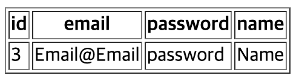

# Spring boot 회원정보 조회

##### list.html
```
<a th:href="@{|/member/${member.id}|}">조회</a>
```
- @{||}는 thymleaf에서 지원하는 방식으로 경로상에 값을 같이 표현하고자 할때 사용한다
    - 주소창에 /member/1 처럼 나오게된다

##### MemberController.java
```
    @GetMapping("/member/{id}")
    public String findById(@PathVariable Long id, Model model) {
        MemberDTO memberDTO = memberService.findById(id);
        model.addAttribute("member", memberDTO);
        return "detail";
    }
```
- @GetMappting에 {id}는 @PathVariable를 통해 값을 가져올수 있다
- id값으로 값을 가져와서 model로 값을 담아 detail에서 사용할수 있게 한다

##### MemberService.java
```
    public MemberDTO findById(Long id) {
        Optional<MemberEntity> optionalMemberEntity = memberRepository.findById(id);
        if(optionalMemberEntity.isPresent()){
            return MemberDTO.toMemberDTO(optionalMemberEntity.get());
        }else{
            return null;
        }
    }
```
- Optional로 값이 있는지 확인후 값이 있다면 MemberEntity의 값을 MemberDTO로 변환후 그 값을 return해준다

##### detail.html
```
<!DOCTYPE html>
<html lang="en" xmlns:th="http://www.thymeleaf.org">
<head>
    <meta charset="UTF-8">
    <meta name="viewport" content="width=device-width, initial-scale=1.0">
    <title>detail</title>
</head>
<body>
    <table border="1">
        <tr>
            <th>id</th>
            <th>email</th>
            <th>password</th>
            <th>name</th>
        </tr>
        <tr>
            <td th:text="${member.id}"></td>
            <td th:text="${member.memberEmail}"></td>
            <td th:text="${member.memberPassword}"></td>
            <td th:text="${member.memberName}"></td>
        </tr>
    </table>
</body>
</html>
```
   
- model.addAttribute로 담은 값을 가져와 사용해 해당 유저의 정보를 확인할 수 있다