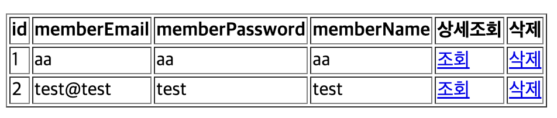

# Spring boot 회원목록

##### index.html
```
<a href="/member/">회원목록</a>
```
- 회원 목록을 보기 위한 a태그 추가

##### MemberController.java
```
    // 회원목록
    @GetMapping("/member/")
    public String findAll(Model model) {
        List<MemberDTO> memberDTOList = memberService.findAll();
        // html로 가져갈 데이터가 있다면 Model을 사용
        model.addAttribute("memberList",memberDTOList);
        return "list";
    }
```
- memberService에 findAll메서드로 값을 가지고 온다
- Model로 html에 가져가야할 데이터가 있다면 addAttribute로 설정한후 list로 return해준다

##### MemberService.java
```
    // 회원목록
    public List<MemberDTO> findAll() {
        List<MemberEntity> memberEntityList = memberRepository.findAll();
        List<MemberDTO> memberDTOList = new ArrayList<>();

        for(MemberEntity memberEntity: memberEntityList){
            memberDTOList.add(MemberDTO.toMemberDTO(memberEntity));
        }
        return memberDTOList;
    }
```
- JPA에서 제공하는 findAll메서드로 회원정보를 List<MemberEntity>에 넣어준다
- Entity에서 dto로 변경해주기 위해 memberDTOList를 하나 만들어준후 for문을 통해 변경을해준후 memberDTOList를 return해준다

##### list.html
```
<!DOCTYPE html>
<html lang="en" xmlns:th="http://www.thymeleaf.org">
<head>
    <meta charset="UTF-8">
    <meta name="viewport" content="width=device-width, initial-scale=1.0">
    <title>list</title>
</head>
<body>
    <h2>list.html</h2>
    <table border="1">
        <tr>
            <th>id</th>
            <th>memberEmail</th>
            <th>memberPassword</th>
            <th>memberName</th>
            <th>상세조회</th>
            <th>삭제</th>
        </tr>
        <tr th:each="member:${memberList}">
            <td th:text="${member.id}"></td>
            <td th:text="${member.memberEmail}"></td>
            <td th:text="${member.memberPassword}"></td>
            <td th:text="${member.memberName}"></td>
            <td>
                <a th:href="@{|/member/${member.id}|}">조회</a>
            </td>
            <td>
                <a th:href="@{|/member/delete/${member.id}|}">삭제</a>
            </td>
        </tr>
    </table>
</body>
</html>
```
   
- <tr th:each="member:${memberList}">로 memberList로 설정한 List를 반복해 값을 가져온다