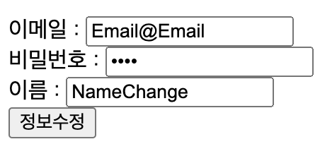
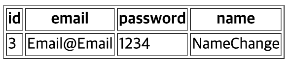

# Spring boot 회원정보 수정

##### main.html
```
<a href="/member/update">내 정보 수정하기</a>
```
- 로그인을 한후 이동되는 main.html에 추가

##### MemberController.java
```
    @GetMapping("/member/update")
    public String updateForm(HttpSession session, Model model) {
        String myEmail = (String)session.getAttribute("loginEmail");
        MemberDTO memberDTO = memberService.updateForm(myEmail);
        model.addAttribute("updateMember", memberDTO);
        return "update";
    }

    @PostMapping("/member/update")
    public String update(@ModelAttribute MemberDTO memberDTO) {
        memberService.update(memberDTO);
        return "redirect:/member/"+memberDTO.getId();
    }
```
- @GetMappting
    - 로그인시 session에 값을 담아두기 떄문에 session의 값을 가져온다
    - memberService.updateForm에서 email로 해당 유저 정보를 가져온후 model에 저장한후 update.html로 이동시킨다
- @PostMapping
    - memberService.update로 회원 정보를 변경해준후 redirect로 다시 회원의 정보를 보여준다

##### MemberService.java
```
    public MemberDTO updateForm(String myEmail) {
        Optional<MemberEntity> optionalMemberEntity = memberRepository.findByMemberEmail(myEmail);
        if(optionalMemberEntity.isPresent()){
            return MemberDTO.toMemberDTO(optionalMemberEntity.get());
        }else{
            return null;
        }
    }

    public void update(MemberDTO memberDTO) {
        memberRepository.save(MemberEntity.toUpdateMemberEntity(memberDTO));
    }
```
- updateForm으로 회원 정보를 가져온다
- updateForm으로 유저 정보를 업데이트 시킨다
    - memberRepository.save는 id(pk)에 동일한 값이 있다면 insert가 아닌 update를 해준다

##### MemberEntity.java
```
    public static MemberEntity toUpdateMemberEntity(MemberDTO memberDTO){
        MemberEntity memberEntity = new MemberEntity();
        memberEntity.setId(memberDTO.getId());
        memberEntity.setMemberEmail(memberDTO.getMemberEmail());
        memberEntity.setMemberName(memberDTO.getMemberName());
        memberEntity.setMemberPassword(memberDTO.getMemberPassword());
        return memberEntity;
    }
```
- id는 이미 있기 떄문에 id값도 세팅을 해줘야 한다

##### update.html
```
<!DOCTYPE html>
<html lang="en" xmlns:th="http://www.thymeleaf.org">
<head>
    <meta charset="UTF-8">
    <meta name="viewport" content="width=device-width, initial-scale=1.0">
    <title>update</title>
</head>
<body>
    <form action="/member/update" method="post">
        <input type="hidden" th:value="${updateMember.id}" name="id"><br>
        이메일 : <input type="text" th:value="${updateMember.memberEmail}" name="memberEmail" readonly><br>
        비밀번호 : <input type="password" th:value="${updateMember.memberPassword}" name="memberPassword"><br>
        이름 : <input type="text" th:value="${updateMember.memberName}" name="memberName"><br>
        <input type="submit" value="정보수정">
    </form>
</body>
</html>
```
   
   
- input태그에 hidden으로 input태그는 보이지 않게 되지만 값을 id값을 같이 보낼수 있게 된다
- input태그에 readonly를 사용하면 수정할수는 없지만 값은 보이게 된다