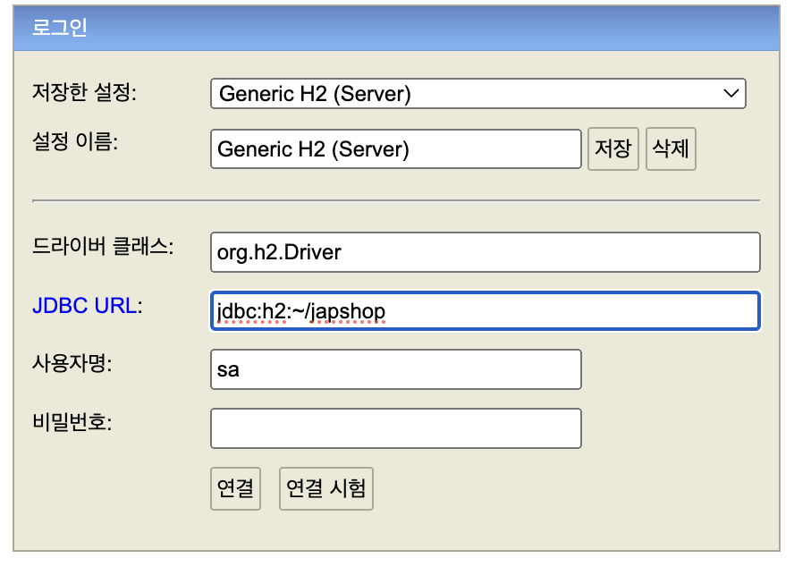

# section1

### 프로젝트 환경설정
[프로젝트 생성 사이트](https://start.spring.io/)   
   
- 사이트를 이용해 간단히 프로젝트를 생성할 수 있다

### Lombok확인
##### Hello.java
```
@Getter @Setter
public class Hello {
    private String data;
}
```
- @Getter,@Setter
    - getter,setter를 자동으로 만들어주는 어노테이션

##### JpashopApplication.java
```
	// lombok 확인
	Hello hello = new Hello();
	hello.setData("hello");
	String data = hello.getData();
	System.out.println("data >> " + data);
```
   
- Lombok이 제대로 설치되었다면 프로젝트 실행시 위와같은 결과를 얻을수 있다

### View 환경 설정
[thymeleaf](https://www.thymeleaf.org/)

##### HelloController.java
```
@Controller
public class HelloController {
    
    @GetMapping("hello")
    public String hello(Model model){
        model.addAttribute("data", "hello!!!");
        return "hello";
    }
}
```
- Model은 Controller에서 View에 값을 넘길수 있다
    - data라는 이름에 hello라는 값이 들어있다
- return으로 해당 html을 찾아 html파일을 열어준다

##### hello.html
```
<!DOCTYPE html>
<html xmlns="http://www.thymeleaf.org">
    <head>
        <title>Hello</title>
        <meta http-equiv="Content-Type" content="text/html; charset=UTF-8" />
    </head>
    <body>
        <p th:text="'안녕하세요! ' + ${data}">안녕하세요. 손님</p>
    </body>
</html>
```
  
- <html xmlns="http://www.thymeleaf.org">를 사용해야만 thymeleaf를 사용할수 있다
- ${data}는 Controller에서 model에 값을 세팅했던 값을 사용한 것이다

##### index.html
```
<!DOCTYPE html>
<html lang="en">
<head>
    <meta charset="UTF-8">
    <meta name="viewport" content="width=device-width, initial-scale=1.0">
    <title>Hello</title>
</head>
<body>
Hello
<a href="/hello">hello</a>
</body>
</html>
```
- hello.html로 이동하는 코드
- template폴더가 아닌 static폴더에 생성

### h2 설치
[h2설치사이트](https://www.h2database.com/html/main.html)   
- 다운을 받고 압축을 푼다음 cmd로 h2폴더에 bin폴더안에있는 h2.sh파일을 실행시킨다
   
- 위와 같이 실행을 한다
- 그후 URL을 jdbc:h2:tcp://localhost/~/jpashop로 변경후 연결시킨다

### JPA, DB설정 및 동작확인
##### Member.java
```
@Entity
@Getter @Setter
public class Member {

    @Id @GeneratedValue
    private Long id;
    private String username;
    
}
```
- @Entity는 테이블과의 매핑을 한다
    - Name속성으로 테이블 명을 정하지 않으면 클래스 이름으로 테이블이 생성된다
- @Getter, @Setter는 필드값에 대한 getter,setter를 생성한다
- @Id는 헤당 필드를 pk로 지정한다
- @GeneratedValue는 기본키를 자동으로 생성해준다

##### MemberRepository.java
```
@Repository
public class MemberRepository {
    @PersistenceContext
    private EntityManager em;

    public Long save(Member member){
        em.persist(member);
        return member.getId();
    }

    public Member find(Long id){
        return em.find(Member.class,id);
    }
}
```
- @Repository를 사용하면 해당 클래스가 스프링의 Bean으로 등록된다
- save메소드는 멤버를 저장하고 해당 멤버의 id값을 리턴해준다
- find메소드는 id값으로 멤버의 정보를 리턴해준다

##### MemberRepositoryTest.java
```
@SpringBootTest
public class MemberRepositoryTest {
    @Autowired MemberRepository memberRepository;

    @Test @Transactional
    @Rollback(false)
    public void testMember() throws Exception{

        // given
        Member member = new Member();
        member.setUsername("memberA");
        
        // when
        Long saveId = memberRepository.save(member);
        Member findMember = memberRepository.find(saveId);
        
        // then
        Assertions.assertThat(findMember.getId()).isEqualTo(member.getId());
        Assertions.assertThat(findMember.getUsername()).isEqualTo(member.getUsername());
        Assertions.assertThat(findMember).isEqualTo(member);
        System.out.println("findMember == member : "+ (findMember==member));
    }
}
```
- 테스트용 코드
- findMember와 member는 같은 트랙잭션 안에서 저장하고 조회했기 때문에 영속성 컨택스트가 같으므로 같은 엔티티로 식별한다
- @Test로 해당 메소드가 테스트임을 지정한다
- Assertions.assertThat().isEqualTo()로 값이 같은지 확인할수 있다
   
   
- @Rollback(false)으로 테이터를 저장후 rollback을 하지않게해 데이터가 저장되게 한다
- 위 사진처럼 데이터가 들어간걸 확인할수 있다